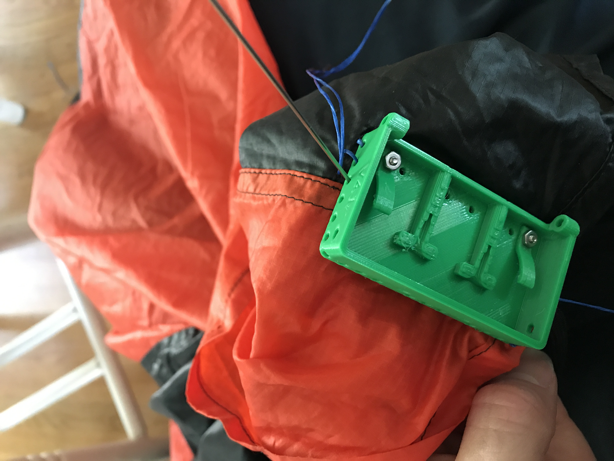
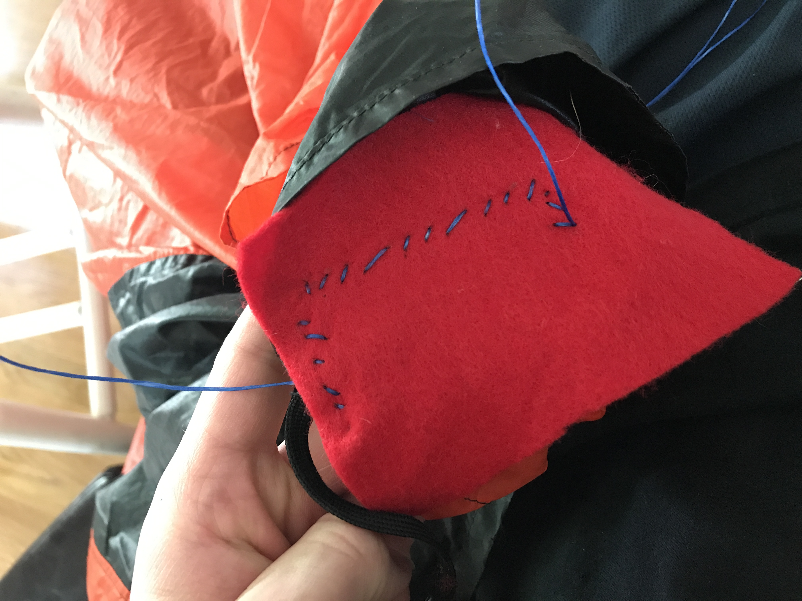
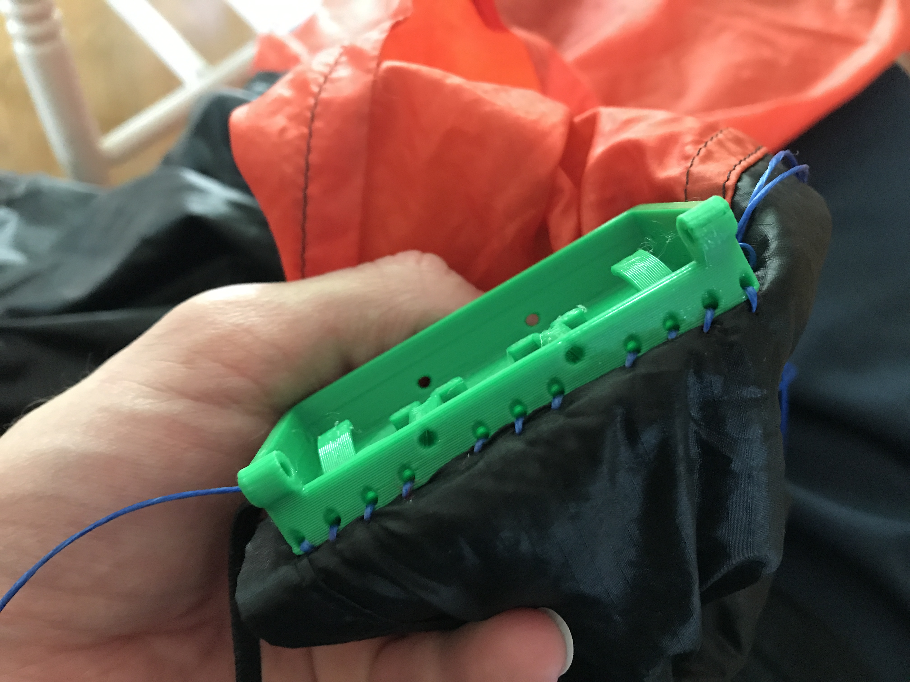
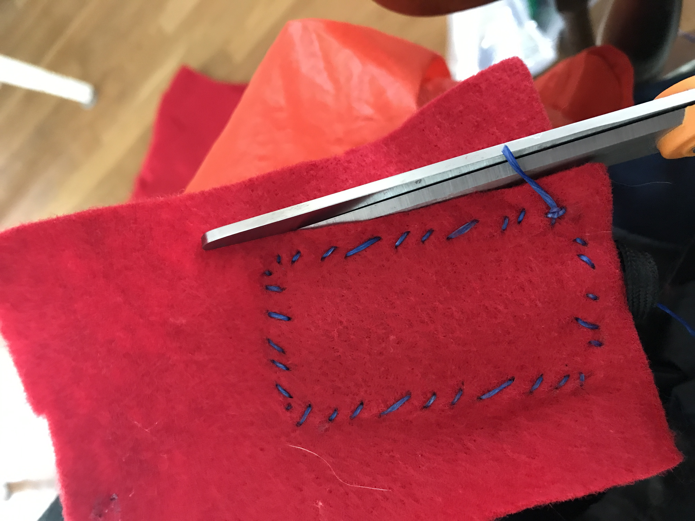
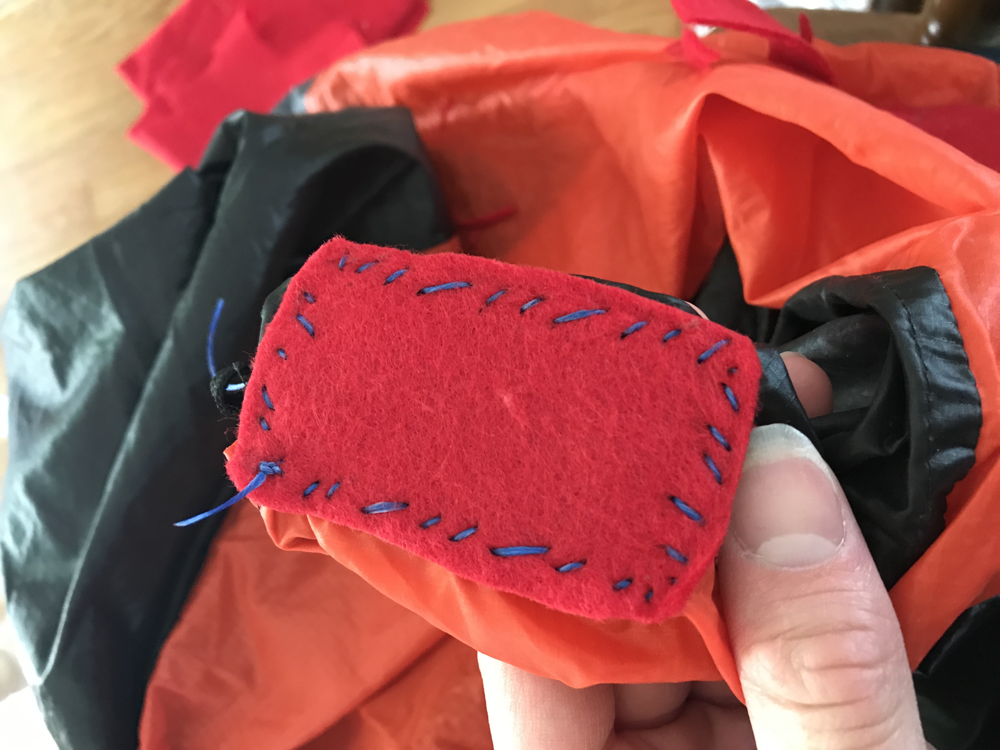
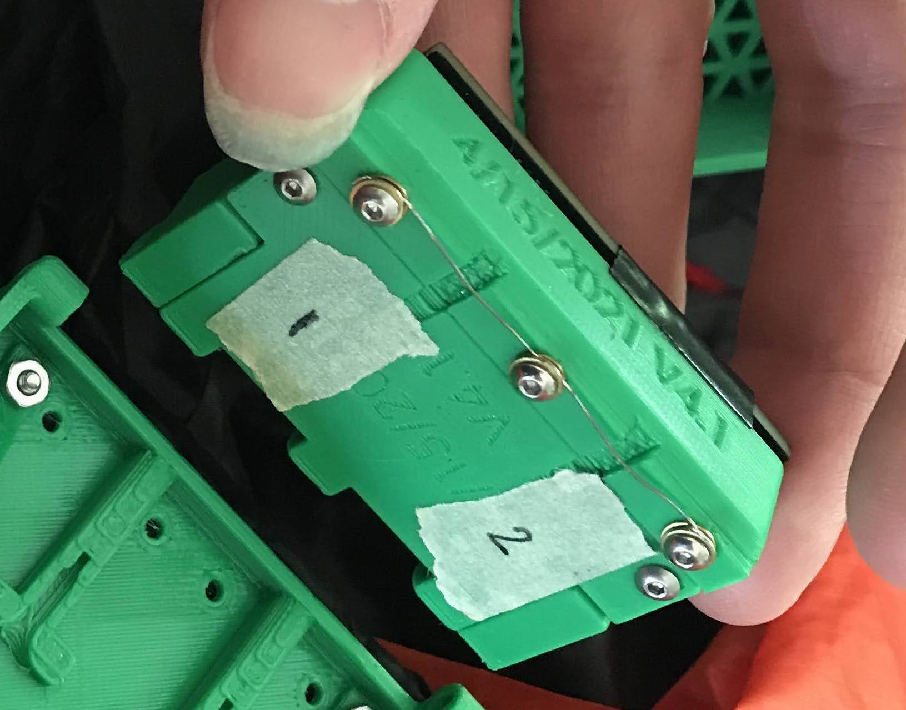
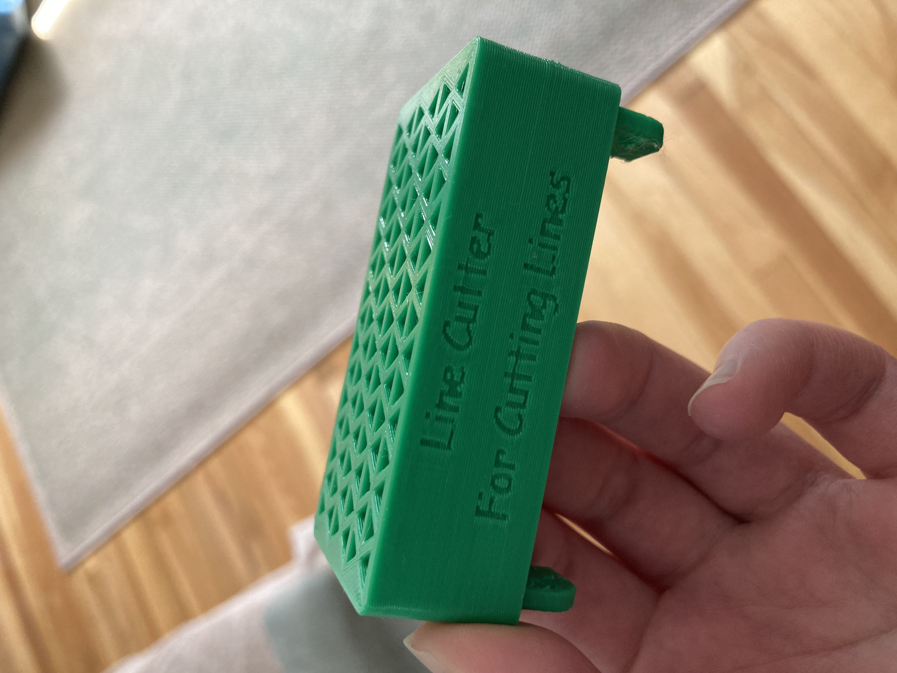
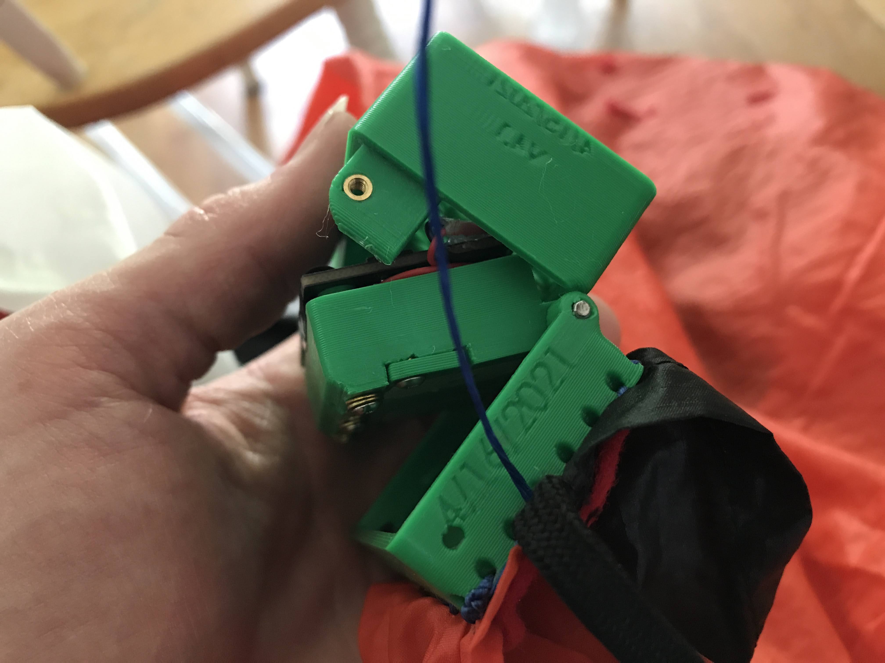
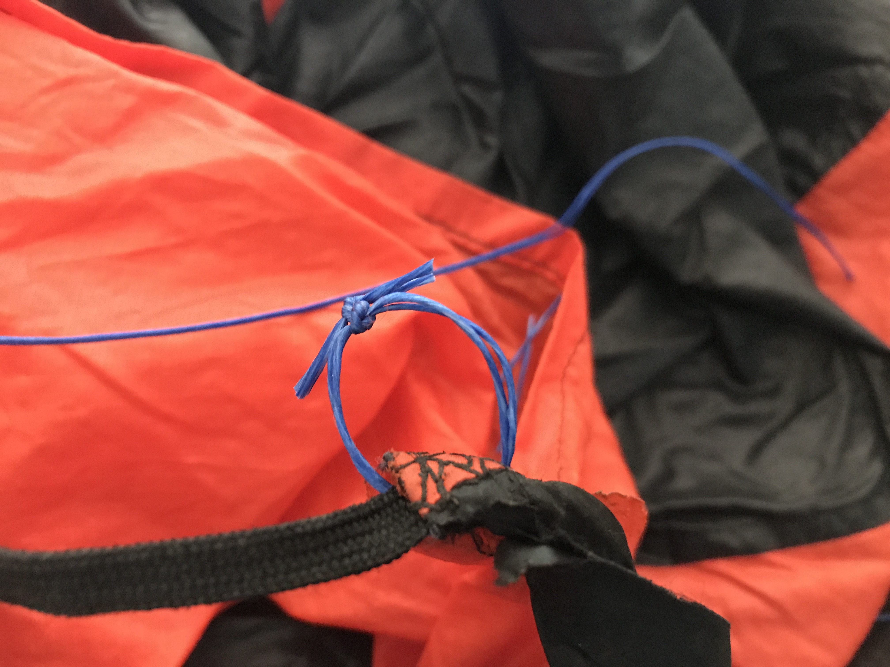
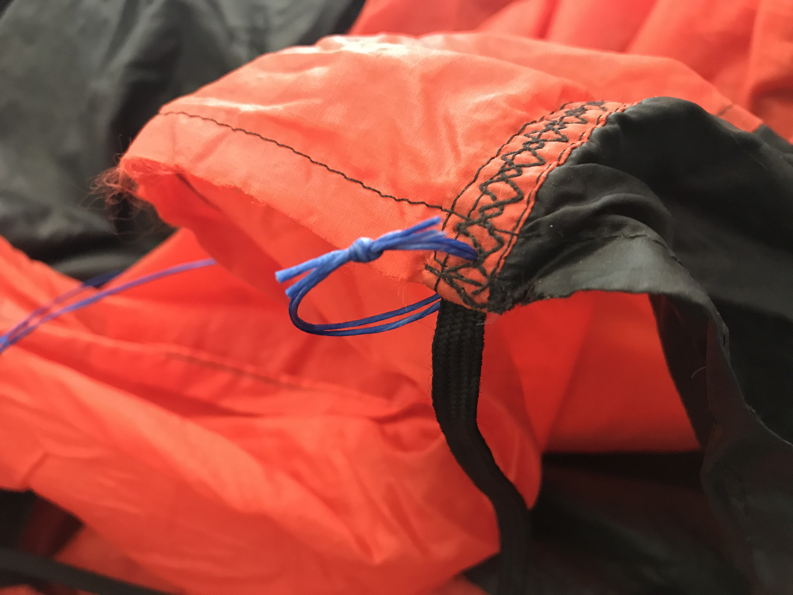

# Line Cutter Setup
blah blah
## Table of Contents
- Materials
- Sew cases and loops
- Assemble cases (with nichrome and PCBs)
- Choose reefing diameters and flight variables
- Upload code
- Use BluefruitConnect
- Pack the parachute
- Steps after launch

## Materials
- 2 line cutter PCBs
- 2 line cutter cases
- 2-56 screws
	- 6 x 1/2"
	- 8 x 3/16" (1/8" works but pain)
	- 4 x 1/4"
- [0.1" diameter music wire](https://www.mcmaster.com/8908K91/)
- [0.8mm spectra](https://www.amazon.com/dp/B0829L71KC/ref=twister_B07DPGJK3L?th=1&psc=1). Don't use 0.5mm.
- [28 gauge nichrome wire](https://www.amazon.com/Nichrome-80-Gauge-Resistance-Wire/dp/B07CHTT73J/ref=sr_1_8?dchild=1&keywords=nichrome&qid=1623200858&sr=8-8)
- whatever's used to sew it on
- big needle
- Parachute
- BluefruitConnect app (available on iOS and Android)
- 3 380mAh LiPos ?
- LiPo charger
- Micro USB cable
- GoPro if you want style points

## Sew cases and loops
- Before you start, install the springy tabs in the bottom of the cases with two #4-40 x 1/4" screws
- Two line cutter cases should be sewn on to the throat of the parachute. They should be situated on opposite sides of the parachute (180º apart). Each case should be sewn to the inside of the chute at a point where one of the shrouds attaches. The longest dimension of the case should be in the direction of the shroud. The two cases should be situated head-to-tail. That is, if you start at the hinged face of one case and travel around the throat of the parachute to the other case in the direction that does not require you to cross through the first case, you should arrive at the second case on its non-hinged side. Use a thick embroidery needle and Delrin string.

- Back each case with a piece of felt to serve as protective batting. The felt will help prevent damage to the thin nylon that the parachute is made of. On the outer face of the parachute it should look something like this:

And on the inner face, it should look like this:

- When you are done, cut away the excess felt from the other side:

So you end up with this:

## Assemble cases (with nichrome and PCBs)
- If you haven't already, insert long-style 4-40 heat set inserts into the three screw holes on the bottom of the rocker. Also insert the heat sets needed to secure the batter cover. In the picture below, there are heat sets underneath each of the screw heads shown. For the nichrome attachment screws, the heat sets should sit flush with the bottom face of the rocker. After that, install the nichrome wire with three 3/16" screws (I think that's the size we used). A washer should go above and below the wire on each screw. The wire should be pulled relatively tight because it will expand significantly when heated. Wrap the wire around each screw once, starting with the left screw and tightening each screw as you go. The nichrome should be aligned on the side of the screws closer to the face of the rocker marked with the date and the version.

- Screw on the battery cover.
- Install short 4-40 heat sets in the tabs extending from the bottom of the casing cover:

Like so:

- Then run a 0.1" diameter music wire hinge pin through the hinge holes on all the casing components to hold the entire case together, as shown in the previous picture

- Sew on double-thick Delrin loops at the point where each of the shrouds attaches to the parachute, except for the attachment points where the line cutters have already been sewn on. The loops should be around 1" in diameter and should pierce the shroud line, or at the very least pass around it (so that the reefing line will tug on the shroud, not just the fabric of the chute). Tie them closed with multiple square knots and put a dab of super glue on the knots.

## Choose reefing diameters and flight variables
## Upload code
## Use BluefruitConnect
## Pack the parachute
## Steps after launch
